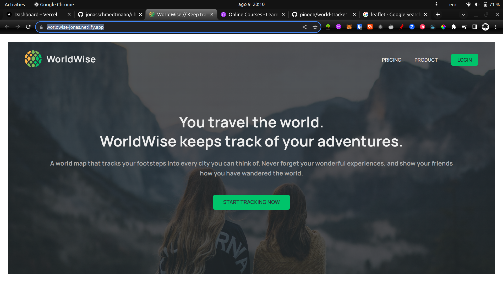
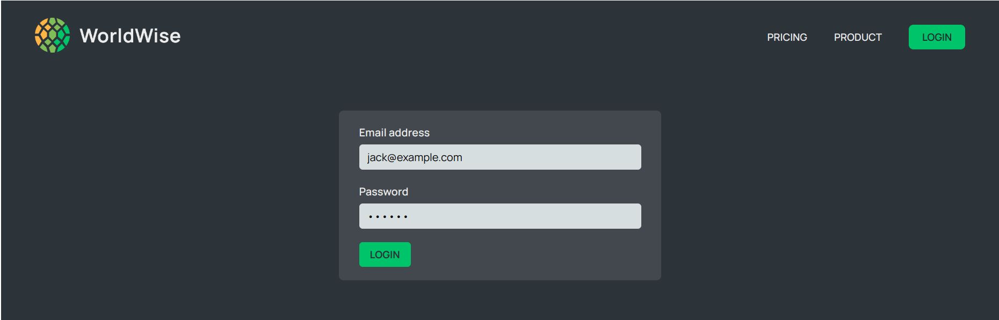
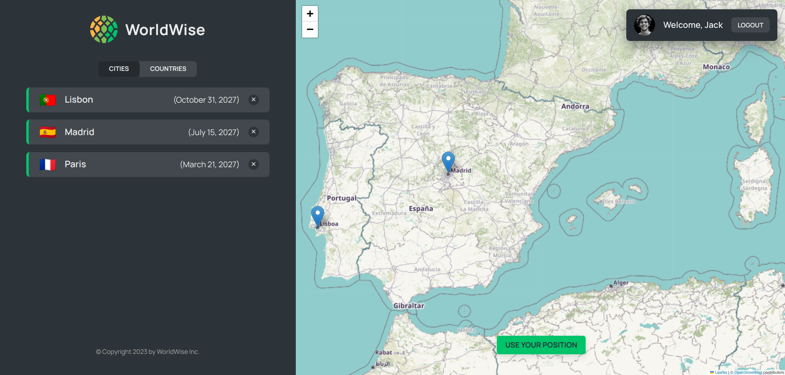
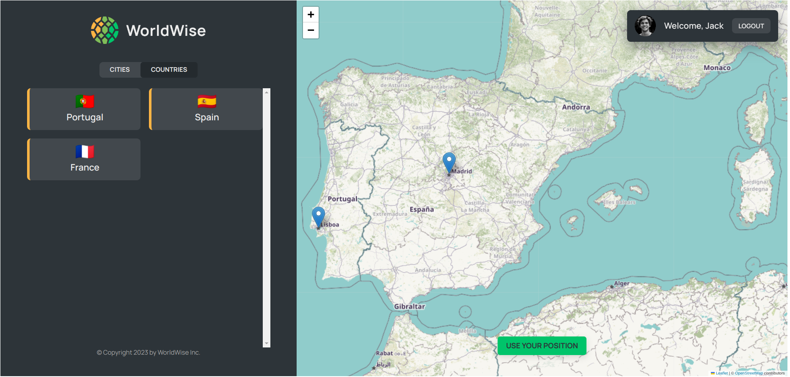
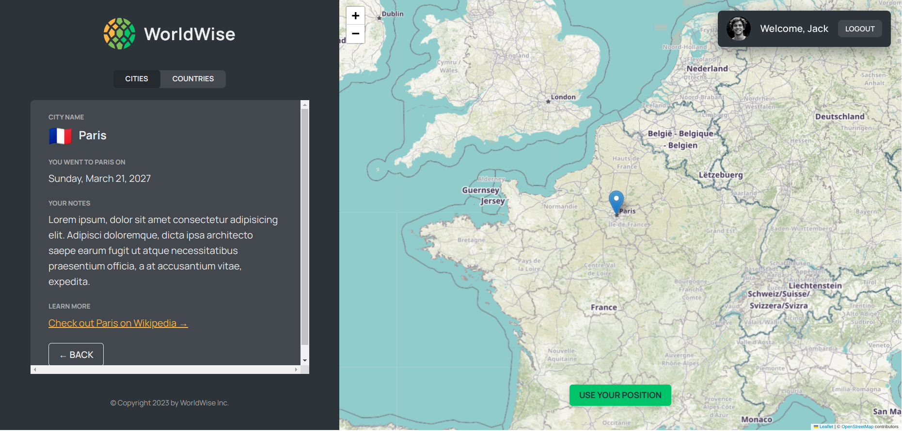
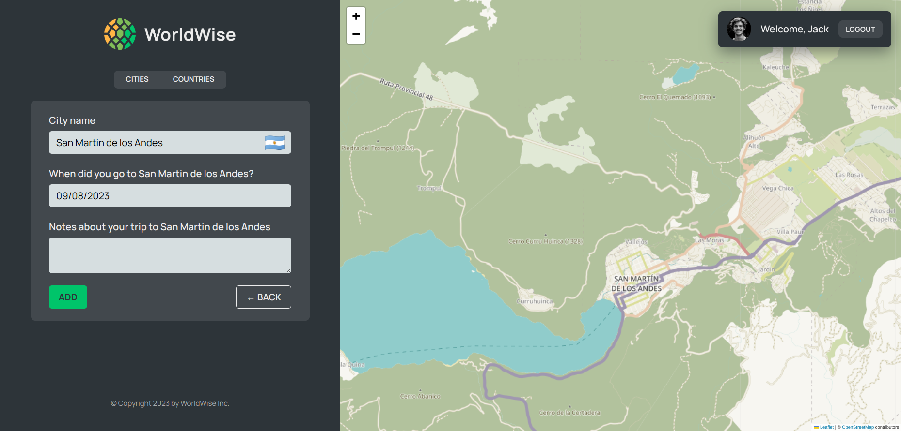

# World Tracker

## Table of Contents
- [Overview](#overview)
- [Built With](#built-with)
- [Features](#features)
- [Acknowledgements](#acknowledgements)

## Overview
- This app is a Single Page Application (SPA).
- We built the application front-end and use a fake API (JSON server library) where to get data from.
- It was built with React using Vite.
- You can try it out at [Netlify - World Tracker](https://worldwise-jonas.netlify.app/)

### Built With
- Routing: React Router
- Styling: CSS modules
- JSON server library
- Leaflet library for interactive maps
- Geolocation API
- Context API
- memo
- useReducer
- useMemo
- useCallback

## Features
- This app allows user register all the cities they have travelled to.

- The app has a homepage, product and pricing, login, cities, countries pages.

- The cities page shows all visited cities and by clicking one of them the user get details.

- The countries page shows all visited countries.

- It has a button to get user's current position.

- By clicking any place on the map, a form get automaticaly completed with data from that place in the world and adicionally the user can add any related note about an specific travel. 

### From those requirements, the app needs these pages:
  1. Homepage
  2. Pricing
  3. Product
  4. Login
  5. App: Cities, Countries, Map

## Acknowledgements
This project is part of The Ultimate React Course 2023: React, Redux & More by [Jonas Schmedtmann](http://jonas.io/).